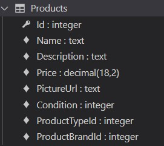
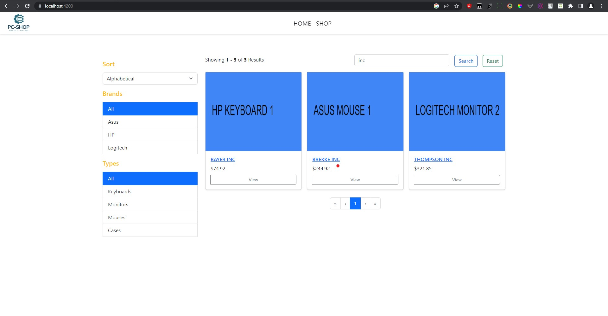

## About the Project

This project represents an early version of the full e-commerce web application developed using Angular and .NET tecnologies. It is a try to replicate most used actions in these kind of applications such as searching, filtering, paginating, adding to a basket and eventually buying a product.


### Built With

Technologies used while building an application:

* Angular
* Bootstrap
* TypeScript
* .NET
* Entity Framework
* SQlite (for development)


### Database Design



![producttypes-db]

![productbrands-db]

Initially, a database is seeded with a mock data generated from Mockaroo with minor changes. As data that is being used is not real, names of the products that are generated represent fake company names.
They were not changed purpusefully because of, not only randomness, but good representation of the sorting task.


## Running an app

How to prepare the enviroment and how to install an app is described as follows:

### Prerequisites

You will need to have Angular (preferably a version 15), node.js (check compatibility with the Angular version installed), npm and .NET 7 installed.
Recommended versions (used while developing this app):

1. Angular: 15.0.2 (RXJS and Typescript come with Angular)
2. NPM: 6.14.10
3. Node: 18.12.1
4. Bootstrap: 5.2.3

### Installation

1. To start the API server, in pc-shop\API type:
   ```sh
   dotnet watch run
   ```
2. To start the Angular server, in pc-shop\client type:
   ```sh
   ng serve --ssl --ssl-key "ssl/server.key" --ssl-cert "ssl/server.crt"
   ```
3. Open:
   ```sh
   https://localhost:4200/
   ```

### Screenshots


   

[app-ss]: images/app-ss.jpg
[products-db]: images/products-db.jpg
[producttypes-db]: images/producttypes-db.jpg
[productbrands-db]: images/productbrands-db.jpg


